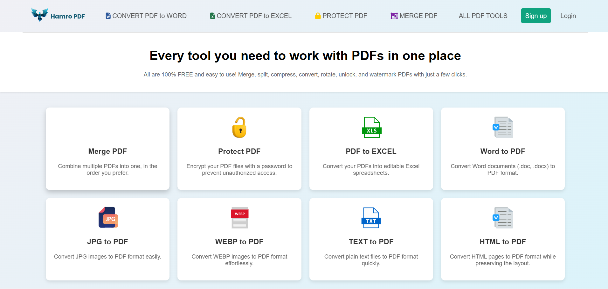
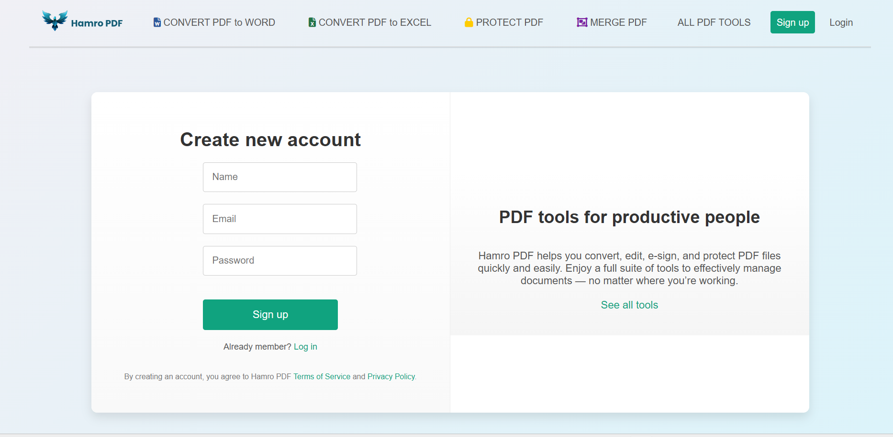
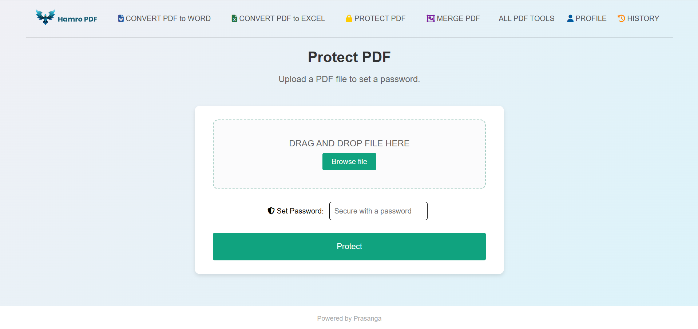
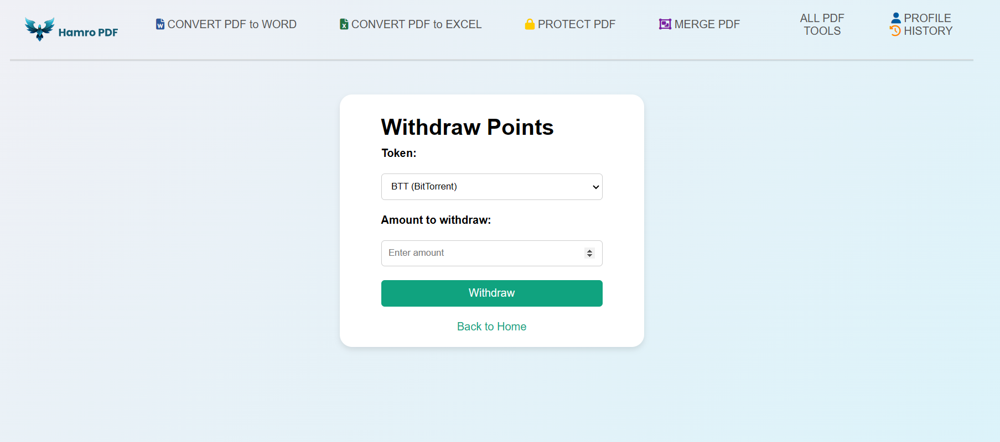
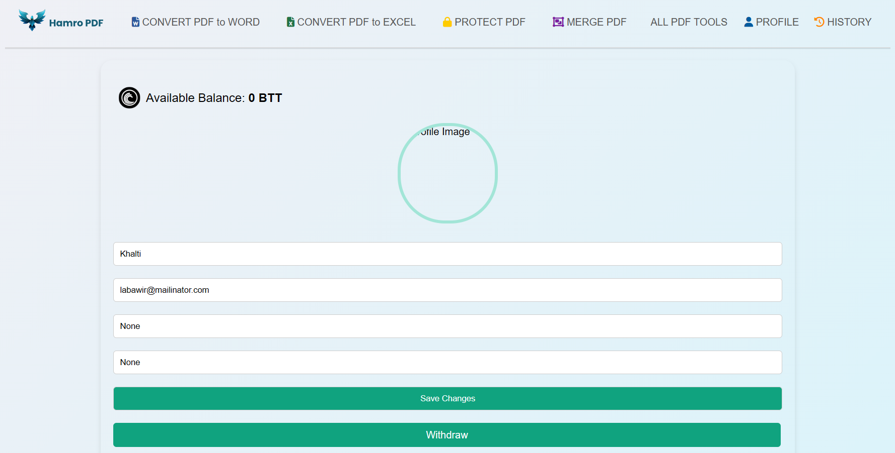

# Document Converter

This project provides a web-based application for converting PDF files to Word documents (DOCX) and Word documents (DOCX) to PDF files.

## Features

🔄 Convert PDF to Word (DOCX)
🔄 Convert PDF to EXCEL (XLSX)
🔄 Convert PDF to JPG (JPG)
🔄 Convert Word (DOCX) to PDF
🔄 Convert Text (TXT) to PDF
🔄 Convert WebP to PDF
🔄 Convert HTML to PDF
🔄 Convert JPG to PDF
🔐 Protect PDF (PASSWORD)
🧲 Merge PD

## Requirements

- Python 3.6 or higher
- MySQL database

## Installation

### 1. Clone the Repository

First, clone the repository to your local machine:

```sh
git clone https://github.com/prasangapokharel/DivineDocs.git
cd Divine Docs

```
### 2.Create and Activate a Virtual Environment

```
python -m venv venv
source venv/bin/activate   # On Windows use `venv\Scripts\activate
```

### 3. Install Required Packages
```
pip install -r requirements.txt
```

### 4. Set Up the MySQL Database
```
CREATE DATABASE pdf_converter;
```

### 5. Run the Flask Application
```
python app.py

```

### 6. Open Your Web Browser

```
http://127.0.0.1:5000/

```


